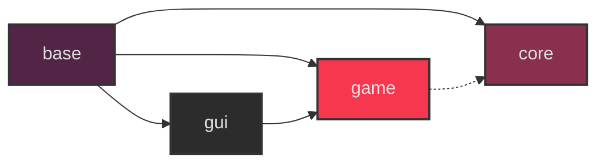

# A tiny game engine/framework

## Deps
```terminal
sudo dnf install git clang clang-devel pkg-config -y
sudo dnf install SDL3 SDL3-devel SDL3_image SDL3_image-devel SDL3_ttf SDL3_tt-devel -y
git lfs install
```
## Cloning
This repo uses git LFS for assets and a submodule for stb libraries, you can:
```bash
git clone --recursive https://github.com/eliasvas/ceng
pushd data
git-lfs pull
popd
```
## Building
### Linux
```bash
./build.sh
```
### Linux (with vim/makeprg)
```
" add this to your .vimrc
set makeprg=./build.sh
set errorformat=%f:%l:%c:\ %trror:\ %m,%f:%l:%c:\ %tarning:\ %m,%f:%l:%c:\ %m,%-G%.%#
nnoremap <silent> <C-k> :cnext<CR>zz
nnoremap <silent> <C-j> :cprev<CR>zz
```

## Module Architecture

