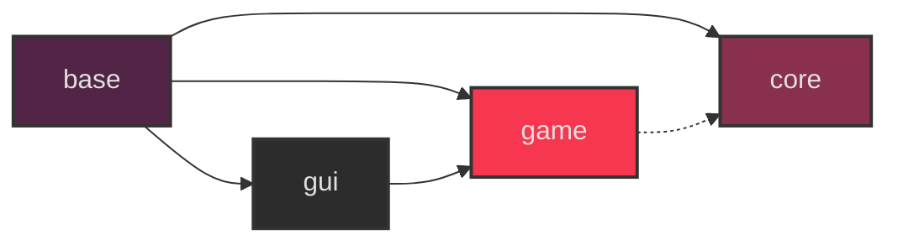

# A tiny game engine/framework

## Deps
```terminal
sudo dnf install git clang clang-devel -y
git lfs install
```
## Cloning
This repo uses git LFS for assets and a submodule for stb libraries, you can:
```bash
git clone --recursive https://github.com/eliasvas/ceng
pushd data
git-lfs pull
popd
```
## Building
### Linux
```bash
./build.sh
```
### Linux (with vim/makeprg)
```
" add this to your .vimrc
set makeprg=./build.sh
set errorformat=%f:%l:%c:\ %trror:\ %m,%f:%l:%c:\ %tarning:\ %m,%f:%l:%c:\ %m,%-G%.%#
nnoremap <silent> <C-k> :cnext<CR>zz
nnoremap <silent> <C-j> :cprev<CR>zz
```
### Web (From Linux)
first install and activate [emscripten](https://emscripten.org/docs/getting_started/downloads.html)
```bash
source path/to/emsdk_env.sh
./build_web.sh
emrun build/index.html
->localhost:8000 in your browser
```

### Making your own game with the engine
You can easily use this engine to make a game by plugging your game's source/data directories like so:
```bash
    mkdir my_awesome_game
    cd my_awesome_game
    git init
    git submodule add https://github.com/eliasvas/ceng
    git submodule update --init --recursive

    cp -r ceng/src/demo/ ./game
    cp -r ceng/data ./data
    git-lfs track *.png
    git-lfs track *.ttf

    cat > build.sh << 'EOF'
    #!/usr/bin/env bash
    set -e
    ENGINE_DIR="./ceng"
    GAME_DIR="./game"
    OUTPUT_DIR="./build"
    "$ENGINE_DIR/build.sh" ed="$ENGINE_DIR" gd="$GAME_DIR" od="$OUTPUT_DIR"
    EOF
    chmod +x build.sh

    ./build.sh
    ./build/ceng
```

## Module Architecture

